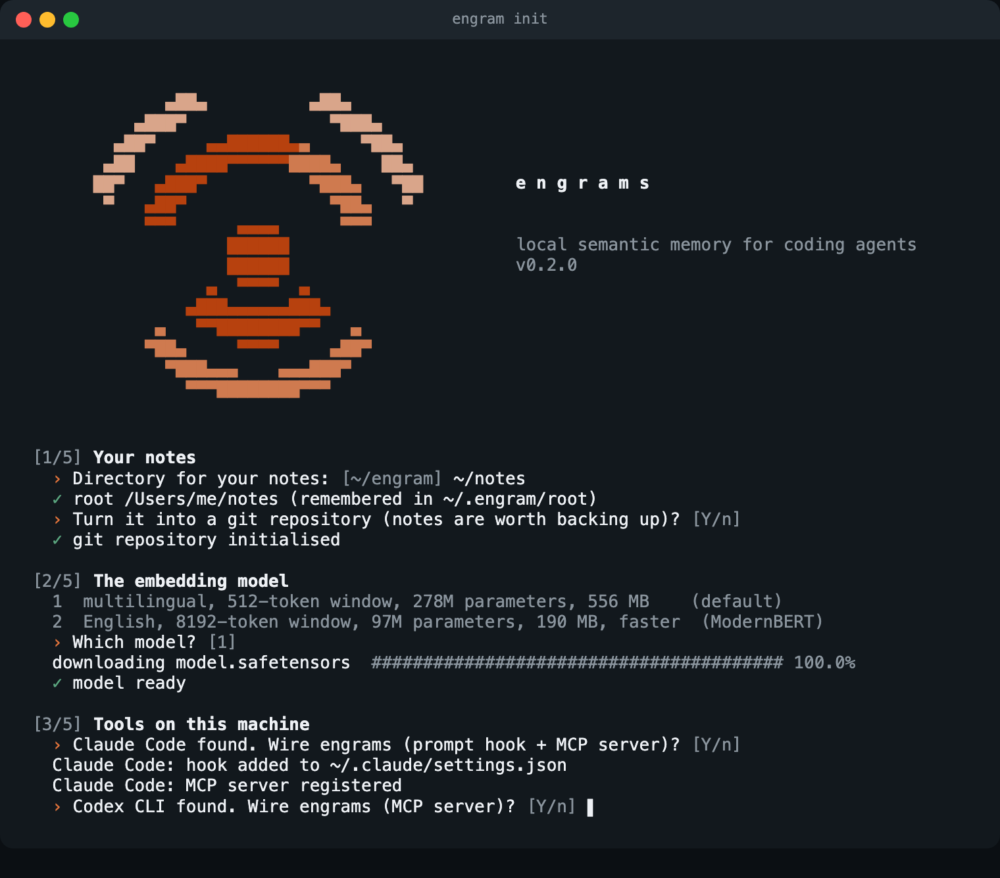
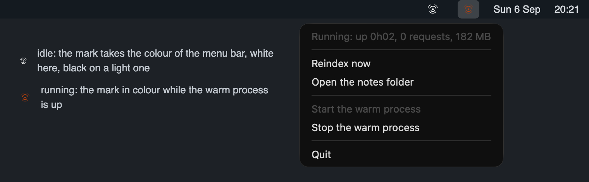
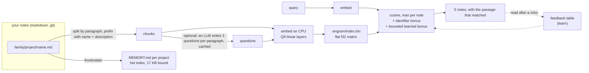

<p align="center">
  
</p>

<p align="center">
  <a href="https://github.com/codexofc/engrams/actions/workflows/ci.yml"></a>
  <a href="https://github.com/codexofc/engrams/actions/workflows/ci.yml"></a>
  <a href="https://github.com/codexofc/engrams/releases/latest"></a>
  <a href="https://github.com/codexofc/engrams/pkgs/container/engrams"></a>
  <a href="LICENSE-MIT"></a>
  
</p>

**Engrams** gives coding agents a durable, searchable memory made of plain markdown
files. One binary, no server, no network at search time, no database. The default
multilingual embedding model (granite-embedding-278m-multilingual, 278 M parameters)
runs on the CPU in **198 MB** of resident memory and answers in **0.10 s**. The notes stay yours: readable by any editor, any agent, any tool, ten
years from now.

It plugs into **Claude Code** (a prompt hook and an MCP server), **Codex CLI**,
**opencode**, **Gemini CLI**, **Cursor**, **Windsurf** and **Kandev** (MCP), and
anything that can run a command. The guided setup finds the tools installed on the
machine and wires them.

```
$ engram search "how are the databases isolated between agents"
0.787  ops/common/agent-pipeline.md verified 2026-09-05
       Agent pipeline on two repositories, isolated worktrees
       "A second database server for the agents: worktrees point DB_HOST at it through the compose file…"
0.655  backend/api/domain-reorg.md verified 2026-08-30
       ...
```

## Install

```sh
curl -sSfL https://raw.githubusercontent.com/codexofc/engrams/master/install.sh | sh
```

The script picks the prebuilt binary for your platform (Linux x86_64 and aarch64,
macOS Apple silicon and Intel) from the [releases](https://github.com/codexofc/engrams/releases),
installs it in `~/.local/bin`, and starts the guided setup. From source, with Rust
1.98 or later:

```sh
cargo install engrams
```

The binary is called `engram`. It needs `curl` once, to download the model.

A container image is published with every release on GitHub Packages, for servers
and sandboxes. The notes live in a volume mounted on `/notes`, the model in another
on `/root/.engram`:

```sh
docker run --rm -v $PWD/notes:/notes -v engrams-models:/root/.engram ghcr.io/codexofc/engrams search "token rotation"
```

## Get started

```sh
engram init
```

<p align="center"></p>

Five steps, each with a default that Enter accepts:

1. **Your notes.** The directory, remembered in `~/.engram/root`, with an ignore
   rule for the derived files and a git repository if you want one.
2. **The model.** Multilingual with a 512-token window (default, 556 MB), a lighter
   multilingual ModernBERT that keeps a whole note in one vector (97 M, 220 MB), or
   five other measured choices. Downloaded once into
   `~/.engram/models/`. See [Models](#models).
3. **Tools on this machine.** Claude Code, Codex CLI, opencode, Gemini CLI, Cursor,
   Windsurf, Kandev: each one found is offered, the prompt hook and the MCP server
   for Claude Code, the MCP server for the others.
4. **Indexed questions**, optional: a local LLM command that writes, once per
   paragraph, the questions it answers. Skippable, settable later.
5. **A first note**, then the first index.

Everything the wizard does is also a plain command:

```sh
engram init ~/notes --no-download            # directory only
engram init ~/notes --model ibm-granite/granite-embedding-97m-multilingual-r2
engram setup claude-code                     # or codex, opencode, gemini, cursor, windsurf, kandev, all
engram config                                # show the settings, or walk through them on a terminal
engram config set ENGRAM_QUESTIONS_CMD "ollama run qwen2.5:3b"
```

Then write a note and search it:

```sh
mkdir -p ~/notes/work/backend
cat > ~/notes/work/backend/token-rotation.md <<'EOF'
---
name: token-rotation
description: API tokens rotate every ninety days, the old one stays valid for one hour
type: reference
status: active
verified: 2026-09-06
---

Rotation is triggered by the `rotate-token` job. The previous token keeps working
for one hour so that in-flight requests finish. Clients read the new token from the
`X-Next-Token` header of any authenticated response.
EOF

engram index
engram search "how long does an old token stay valid"
```

## Integrations

### Claude Code

`engram setup claude-code` adds a `UserPromptSubmit` hook to `~/.claude/settings.json`
and registers the MCP server. Every prompt then arrives with a `<working-memory>`
block holding the two passages closest to it, and the model has the `search`,
`answer`, `read`, `write`, `append`, `link` and `learn` tools. Claude Code also loads
a `MEMORY.md` from its per-project memory directory: point that directory at the
matching `<family>/<project>/` of your root with a symbolic link and the hot index
is loaded at every session.

Add a few lines to your `CLAUDE.md` (or `AGENTS.md` for the tools that read it) so
the model uses the memory deliberately:

```markdown
## Working memory
Durable facts live in engrams. Before a task, search it (`engram search` or the
`search` tool). Read a note with `engram read` before relying on it. Write durable
facts with `engram write`, complete them with `engram append`, replace them with
`engram supersede`; never edit the generated MEMORY.md files. Nothing dated, no
secrets.
```

### Codex CLI, opencode, Gemini CLI, Cursor, Windsurf

```sh
engram setup codex      # ~/.codex/config.toml, [mcp_servers.engram]
engram setup opencode   # ~/.config/opencode/opencode.json, mcp
engram setup gemini     # ~/.gemini/settings.json, mcpServers
engram setup cursor     # ~/.cursor/mcp.json, mcpServers
engram setup windsurf   # ~/.codeium/windsurf/mcp_config.json, mcpServers
```

Each one registers `engram mcp` as a local MCP server, idempotently, with a backup
of the edited file.

### Kandev

Cards run Claude Code or opencode with the user's configuration, so the setups above
apply inside cards. For Kandev's own MCP settings, `engram setup kandev` prints the
snippet to paste.

### Any other agent

`engram mcp` speaks the Model Context Protocol over stdio. `engram answer --json`
returns passages for scripts. `engram context <topic> --out brief.md` writes a
brief. `engram hook` reads Claude Code's hook JSON and prints the passages.

## Everyday commands

| command | what it does |
|---|---|
| `engram search <words>` | five notes at most, with score, path, description and the passage that matched; `--archives` includes replaced notes |
| `engram answer <question>` | the passages that answer, bounded in size, ready to cite; `--json` for tools |
| `engram context <topic>` | a markdown brief to hand an agent before it starts |
| `engram read <name>` | print a note; a read after a search that missed it is a learning signal |
| `engram write <family/project> <name> --type <t> --description <d>` | write a note (body on stdin); refuses secrets and near-duplicates of an active note |
| `engram append <name>` | add a paragraph, mark verified today |
| `engram verify <name>` | the fact still holds, the date says so |
| `engram supersede <old> <new> --type <t> --description <d>` | replace a fact: new note, old one archived with `superseded_by`, links rewritten |
| `engram link <a> <b>` | cross-reference two notes |
| `engram learn "<query>" <name>` | confirm that a note answers a query; `--show`, `--forget` |
| `engram index` | embed what changed, regenerate the `MEMORY.md` files |
| `engram check` | naming, mandatory fields, dangling links, bound of the hot index, truncated paragraphs, near-duplicates |
| `engram secrets` | exit 1 if any note looks like it contains a token, a key or a password (use it as a pre-commit hook) |
| `engram curation` | a markdown checklist of stale, long, undated or duplicated notes |
| `engram since 7`, `engram why <name>` | what changed, and where a note comes from (git) |
| `engram status`, `engram stop` | the warm process, the index, the usage cadence. `engram status --short` prints one line while the process runs, for a shell prompt or a status bar |
| `engram tray`, `engram tray install` | the Engrams mark in the menu bar or system tray, see below |

## Menu bar

`engram tray` puts the Engrams mark in the menu bar (macOS) or the system tray. It
watches the warm process every five seconds: the mark takes the colour of the bar
while nothing runs, and turns to its own colours while the warm process is up.

<p align="center"></p>

The menu shows the state of the warm process (uptime, requests served, resident
memory) and offers four actions:

- **Reindex now** runs `engram index` in the background.
- **Open the notes folder** opens the root in the file manager.
- **Start the warm process** and **Stop the warm process**, one enabled at a time.
- **Quit** closes the menu bar item; the warm process keeps running.

`engram tray install` starts it at login (a launchd agent on macOS, an XDG autostart
entry on Linux), `engram tray uninstall` removes it. The macOS release binaries ship
the tray; elsewhere build it with `cargo install engrams --features tray` and the GTK
development packages. It pairs well with `ENGRAM_IDLE=never` from `engram config`,
which keeps the warm process resident.

## Notes

```yaml
---
name: token-rotation          # equals the file name, lowercase ASCII, digits, dashes
description: One line. It decides relevance in the hot index and prefixes every chunk.
type: reference               # user | feedback | project | reference
status: active                # active | archived (archived notes name their successor)
verified: 2026-09-06          # date of the last verification
depends_on: tool 1.2          # optional, pinned version; `check` compares it with the installed one
superseded_by: [[other-note]] # set by `supersede`
source: TICKET-123            # optional
---

Markdown body. Paragraphs are the unit of indexing. [[wiki links]] are checked.
```

Notes live in `<root>/<family>/<project>/<name>.md`. A project named `common`
inside a family is listed in the hot index of every sibling project. `engram check`
enforces the rules. The `MEMORY.md` of each project is generated, ordered by type
(durable knowledge first, ongoing projects last) and bounded to 17 KB: when it
overflows, the oldest project notes leave first and a line says how many are
missing.

## Configuration

Settings live in `~/.engram/env`, one `KEY=VALUE` per line, managed by
`engram config` and read at every start. An environment variable of the same name
wins.

| variable | default | purpose |
|---|---|---|
| `ENGRAM_ROOT` | `~/.engram/root` pointer, else `~/engram` | notes directory |
| `ENGRAM_MODEL` | `~/.engram/models/granite-embedding-278m-multilingual` | model directory |
| `ENGRAM_PRECISION` | `q8` | `f32` restores full-precision linear layers |
| `ENGRAM_NO_DAEMON` | unset | never start the warm process |
| `ENGRAM_IDLE` | 300 | seconds without a request before the warm process exits, or `never` to keep it resident |
| `ENGRAM_WATCH` | 30 | seconds between background refreshes of the warm process |
| `ENGRAM_QUESTIONS_CMD` | unset | command that writes the questions a paragraph answers (text on stdin, one per line) |
| `ENGRAM_QUESTIONS_BATCH` | unlimited / 4 | paragraphs sent per pass (`index` / warm process) |
| `ENGRAM_ID_BONUS` | 0.04 | lexical bonus per identifier found in a note |
| `ENGRAM_LEARN` | 1 | `0` disables the learned bonus |
| `ENGRAM_DUP` | 0.90 | cosine above which a new note is a duplicate |
| `ENGRAM_HOOK_MIN`, `ENGRAM_HOOK_CHARS`, `ENGRAM_HOOK_LEN` | 0.60, 700, 30 | hook thresholds |

### Indexed questions

Any command that reads a prompt on stdin and prints lines works, for example a
local model through a CLI:

```sh
engram config set ENGRAM_QUESTIONS_CMD "ollama run qwen2.5:3b"
engram index        # generates once per paragraph, cached in .engram/questions.json
```

The cache is keyed by paragraph fingerprint and worth versioning: a whole-corpus
generation takes about an hour of model calls, an unchanged paragraph never goes
through the model twice.

## Models

| model | alias | languages | window | parameters | license | when |
|---|---|---|---|---|---|---|
| [granite-embedding-278m-multilingual](https://huggingface.co/ibm-granite/granite-embedding-278m-multilingual) | `granite-multilingual` (default) | 100+ | 512 tokens | 278 M | Apache-2.0 | notes in several languages, or a mix |
| [multilingual-e5-small](https://huggingface.co/intfloat/multilingual-e5-small) | `e5-small` | 100+ | 512 tokens | 118 M | MIT | the small multilingual option, 384 dimensions |
| [multilingual-e5-base](https://huggingface.co/intfloat/multilingual-e5-base) | `e5-base` | 100+ | 512 tokens | 278 M | MIT | multilingual, mean pooling |
| [multilingual-e5-large](https://huggingface.co/intfloat/multilingual-e5-large) | `e5-large` | 100+ | 512 tokens | 560 M | MIT | multilingual, 1024 dimensions, the heaviest choice |
| [granite-embedding-97m-multilingual-r2](https://huggingface.co/ibm-granite/granite-embedding-97m-multilingual-r2) | `granite-multilingual-r2` | 100+ | 32 768 tokens | 97 M | Apache-2.0 | the lightest ModernBERT, a whole note in one vector |
| [granite-embedding-english-r2](https://huggingface.co/ibm-granite/granite-embedding-english-r2) | `granite-en` | English | 8192 tokens | 149 M | Apache-2.0 | English, long context, 768 dimensions |
| [gte-modernbert-base](https://huggingface.co/Alibaba-NLP/gte-modernbert-base) | `gte-modernbert` | English | 8192 tokens | 149 M | Apache-2.0 | English, strong on public retrieval benchmarks |

`engram models` lists them with the one in use, `engram models use <alias>` downloads
and switches (the index is rebuilt at the next `engram index`), and the guided setup
asks the same question. Any other Hugging Face repository or local directory works
in place of the alias. The e5 models expect a `query: ` or `passage: ` prefix and
get it automatically. All run on the CPU with Q8 linear layers by default. Three
encoder families are implemented: XLM-RoBERTa (SentencePiece Unigram tokenizer,
read from the native model file), BERT, and ModernBERT (byte-level BPE tokenizer,
alternating global and sliding-window attention, rotary positions, activation read
from the configuration). Any sentence-embedding checkpoint of those families with `cls` or
`mean` pooling declared in `1_Pooling/config.json` should load; every model change
must pass the concordance test (cosine above 0.999 with reference vectors) before it
is served. A plausible wrong vector is the failure mode this project refuses.
All seven were measured on the same private corpus (296 bilingual notes, 96 blind
queries, text only, Q8) and in isolation (one search on a two-note root, peak
memory). Full tables in [docs/BENCHMARKS.md](docs/BENCHMARKS.md).

| alias | topic | detail | identifier | first bench | overall | isolated call | peak memory |
|---|---|---|---|---|---|---|---|
| `granite-multilingual` (default) | 83 % | 58 % | 75 % | 81 % | 75 % | 0.18 s | 315 MB |
| `e5-small` | 62 % | 58 % | 100 % | 64 % | 66 % | 0.20 s | 222 MB |
| `e5-base` | 71 % | 58 % | 100 % | 64 % | 69 % | 0.20 s | 478 MB |
| `e5-large` | 79 % | 71 % | 100 % | 78 % | 79 % | 0.55 s | 1 527 MB |
| `granite-multilingual-r2` | 83 % | 54 % | 100 % | 72 % | 74 % | 0.43 s | 290 MB |
| `granite-en` | 67 % | 71 % | 100 % | 50 % | 66 % | 0.24 s | 370 MB |
| `gte-modernbert` | 50 % | 50 % | 92 % | 39 % | 51 % | 0.27 s | 370 MB |

<p align="center"></p>

<p align="center"></p>

The default model is the best trade on a bilingual corpus. e5-large buys four
points overall for five times the memory. granite-multilingual-r2 is the lightest
ModernBERT, multilingual, with a whole note in one vector. The default model also carries the two signals the
others were measured without: the identifier bonus and the indexed questions, which
lift it to 83 / 75 / 100 / 81 %.

## Why Engrams

Agents accumulate knowledge session after session, then lose it: the notes are
there, but a keyword search misses half of them, especially when notes mix two
languages or say the same thing with different words. Sending the notes to a remote
vector service solves the search and creates a dependency, a bill and a leak.

Engrams keeps everything local and measures what it claims. On a private corpus of
296 bilingual notes with 96 blind queries, default model
(granite-embedding-278m-multilingual, Q8), every signal on:

| query family | words only | Engrams, default model |
|---|---|---|
| topic of a note (24 cases) | 33 % | **83 %** |
| buried detail in a long note (24) | 54 % | **75 %** |
| named identifier (12) | 75 % | **100 %** |
| first benchmark, one third cross-language (36) | 19 % | **81 %** |

<p align="center"></p>

The engine started at 1.8 GB resident and 0.70 s per search. Every step down was a
mathematical observation applied to the code, measured alone, with the answers
verified identical (cosine 0.9999 to full precision, benchmark unchanged):

<p align="center"></p>

| step | why it works |
|---|---|
| embedding table read from the file | the first layer is a row gather, not a matmul: a query touches n rows out of 250 002 |
| Q8_0 on the linear layers | block quantisation with zero-mean error, cancelled in 768-term dot products |
| compact tokenizer | Unigram segmentation is a shortest path; a hash map and Viterbi replace a 380 MB trie |
| native SentencePiece model | the vocabulary is read from the original 5 MB protobuf, no 9 MB JSON tree |

Full tables, protocol and error bars: [docs/BENCHMARKS.md](docs/BENCHMARKS.md).

## Under the hood



- **Files are the truth.** The index is derived and disposable; its header records
  the model, weights, dimension and pooling, and any mismatch rebuilds it rather than
  mixing vectors.
- **Chunks, not notes.** A single vector for a long note represents its dominant
  topic, not its details. Notes are split along their markdown structure, never
  inside a paragraph, and each chunk carries the note's name and description.
- **Questions, optionally.** A query is short and interrogative, a paragraph is long
  and declarative. Any command-line LLM can write, once per paragraph, the questions
  it answers; they are indexed next to it. On the benchmark this lifts buried details
  from 58 % to 75 %.
- **Learning that cannot drift.** Nothing is learned from the engine's own results.
  Two external signals only: an explicit confirmation, or a note read after a search
  that did not show it. The bonus is capped, decays with a sixty-day half-life, and
  only reorders candidates already within 0.10 of the top score.
- **A warm process when useful.** The first search starts a background process that
  keeps the model loaded, refreshes the index when notes change, and exits after
  five minutes without a request. Isolated calls work too, at 0.21 s and 310 MB peak.

More in [docs/ARCHITECTURE.md](docs/ARCHITECTURE.md).

## Principles

1. **Files are the truth, everything else is derived and disposable.**
2. **A control that only exists in prose does not exist.** Every rule is a check.
3. **Measure before deciding, and record what was discarded.** The benchmark came
   before the model.
4. **No silent error.** Unknown pooling, mismatched index, non-finite vector,
   truncated paragraph: refused or announced, never absorbed.
5. **Low level where it runs.** Memory layout, precision and evaluation order are
   decisions this code makes itself; that is where the 1.8 GB went.

## Contributing and license

See [CONTRIBUTING.md](CONTRIBUTING.md) and [CHANGELOG.md](CHANGELOG.md). Licensed
under either of [Apache License, Version 2.0](LICENSE-APACHE) or
[MIT license](LICENSE-MIT) at your option. The models are distributed by IBM under
Apache-2.0.
