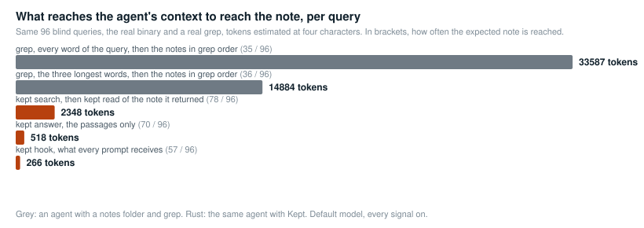

<p align="center">
  
</p>

<p align="center">
  <a href="https://github.com/codexofc/kept/actions/workflows/ci.yml"></a>
  <a href="https://github.com/codexofc/kept/actions/workflows/ci.yml"></a>
  <a href="https://github.com/codexofc/kept/releases/latest"></a>
  <a href="https://github.com/codexofc/kept/pkgs/container/kept"></a>
  <a href="LICENSE-MIT"></a>
  
</p>

**Kept** gives coding agents a durable, searchable memory made of plain markdown
files. One binary, no server, no network at search time, no database. The embedding
model runs on the CPU in **198 MB** of resident memory and answers in **0.10 s**. The
notes stay yours: readable by any editor, any agent, any tool, ten years from now.

It plugs into **Claude Code** (a prompt hook and an MCP server), **Codex CLI**,
**opencode**, **Gemini CLI**, **Cursor**, **Windsurf** and **Kandev** (MCP), and
anything that can run a command. The guided setup finds the tools installed on the
machine and wires them.

```
$ kept search "how are the databases isolated between agents"
0.787  ops/common/agent-pipeline.md verified 2026-09-05
       Agent pipeline on two repositories, isolated worktrees
       "A second database server for the agents: worktrees point DB_HOST at it through the compose file…"
0.655  backend/api/domain-reorg.md verified 2026-08-30
       ...
```

## Why

Agents accumulate knowledge session after session, then lose it: the notes are
there, but a keyword search misses half of them, especially when notes mix two
languages or say the same thing with different words. Sending the notes to a remote
vector service solves the search and creates a dependency, a bill and a leak.

Kept keeps everything local and measures what it claims, on a private corpus of
296 bilingual notes (1.7 MB, 21 projects) with 96 queries written blind, default
model, every signal on. Recall first, the expected note among the five returned:

| query family | words only (a well-ranked grep) | Kept |
|---|---|---|
| topic of a note (24 cases) | 33 % | **83 %** |
| buried detail in a long note (24) | 54 % | **75 %** |
| named identifier (12) | 75 % | **100 %** |
| first benchmark, one third cross-language (36) | 19 % | **81 %** |

Then what the memory costs the agent in context, at the three moments it touches
it. Every line is measured with the real binary on the same 96 queries, tokens
estimated at four characters:

| moment | without Kept | with Kept |
|---|---|---|
| **every prompt**: the Claude Code hook adds the passages closest to it, two of 700 characters at most, or nothing | nothing arrives | **266 tokens** on average, the expected note already there 57 times out of 96 |
| **a consultation**: the agent decides to look something up before a task | Claude Code greps the notes with one to three keywords, then reads whole files. Measured with the three longest words of the query: **14 900 tokens**, the right note reached 36 times out of 96. With every word of the query: 33 600 tokens, 35 times | `search` then `read` of the note it returned: **2 350 tokens**, the right note 78 times out of 96. `answer` alone, passages to cite: 520 tokens, 70 times |
| **a session start**: the hot index of the project, loaded by Claude Code | the notes of the project, or an index that grows with them | one generated `MEMORY.md`, **17 KB at most**, 2 500 characters on average here (about 630 tokens) |

<p align="center"></p>

So one consultation saves **12 500 input tokens** against the keyword grep, 31 000
against the every-word grep, and the hook costs a quarter of a thousand per prompt.
At the list prices of September 2026, per thousand consultations:

| model, input price per million tokens | keyword grep | Kept, search and read | saved per 1 000 consultations | saved if the agent grepped every word |
|---|---|---|---|---|
| Claude Fable 5.1, GPT-6 Astra ($10) | $149 | $23 | **$125** | $312 |
| Claude Opus 5, GPT-5.5 ($5) | $74 | $12 | **$63** | $156 |
| GPT-5.6 Sol ($4) | $60 | $9 | **$50** | $125 |
| Claude Sonnet 5, GPT-5.6 Terra, Gemini 3.1 Pro ($2) | $30 | $5 | **$25** | $62 |
| Gemini 3.8 Flash ($0.75) | $11 | $2 | **$9** | $23 |

Scale: at a hundred prompts a day, the hook costs 27 000 tokens, $0.13 on Claude
Opus 5. List prices of the input token, no caching or batch discount, because the notes an agent reads are new
content each time. The newest Claude tokenizer yields about 30 % more tokens for the
same text, so the dollar figures are a floor. Protocol, error bars, sources and the
other models in [docs/BENCHMARKS.md](docs/BENCHMARKS.md). The corpus above is
private, so two synthetic ones ship in `bench/corpora/` with their blind queries,
220 and 30 notes: `scripts/bench-corpus.sh large` replays everything on them (on the
large one, 92 / 100 / 100 % against 50 / 79 / 92 % for words only, and 1 583 tokens
per consultation against 5 325 for a keyword grep). These figures assume notes in
the format `kept check` enforces; a memory imported raw from another tool scores
lower until it is converted.

## Install

```sh
curl -sSfL https://raw.githubusercontent.com/codexofc/kept/master/install.sh | sh
```

The script picks the prebuilt binary for your platform (Linux x86_64 and aarch64,
macOS Apple silicon and Intel) from the [releases](https://github.com/codexofc/kept/releases),
installs it in `~/.local/bin`, and starts the guided setup. On macOS and Linux with
Homebrew: `brew install codexofc/tap/kept`. From source, with Rust 1.98 or later:
`cargo install kept --features tray`. The binary is called
`kept`. It needs `curl` once, to download the model.

For servers and sandboxes, a container image is published with every release. The
notes live in a volume mounted on `/notes`, the model in another on `/root/.kept`:

```sh
docker run --rm -v $PWD/notes:/notes -v kept-models:/root/.kept ghcr.io/codexofc/kept search "token rotation"
```

## Get started

```sh
kept init
```

<p align="center"></p>

Five steps, each with a default that Enter accepts:

1. **Your notes.** The directory, remembered in `~/.kept/root`, with an ignore
   rule for the derived files and a git repository if you want one.
2. **The model.** The multilingual default (278 M, 556 MB), a lighter multilingual
   ModernBERT that keeps a whole note in one vector (97 M, 220 MB), or five other
   measured choices, downloaded once into `~/.kept/models/`. See [Models](#models).
3. **Tools on this machine.** Claude Code, Codex CLI, opencode, Gemini CLI, Cursor,
   Windsurf, Kandev: each one found is offered, the prompt hook and the MCP server
   for Claude Code, the MCP server for the others.
4. **Indexed questions**, optional: a local LLM command that writes, once per
   paragraph, the questions it answers. Skippable, settable later.
5. **A first note**, then the first index.

Everything the wizard does is also a plain command:

```sh
kept init ~/notes --no-download            # directory only
kept init ~/notes --model e5-small         # an alias, a Hugging Face repository or a directory
kept setup claude-code                     # or codex, opencode, gemini, cursor, windsurf, kandev, all
kept config                                # show the settings, or walk through them on a terminal
kept config set KEPT_QUESTIONS_CMD "ollama run qwen2.5:3b"
```

Then write a note and search it:

```sh
mkdir -p ~/notes/work/backend
cat > ~/notes/work/backend/token-rotation.md <<'EOF'
---
name: token-rotation
description: API tokens rotate every ninety days, the old one stays valid for one hour
type: reference
status: active
verified: 2026-09-06
---

Rotation is triggered by the `rotate-token` job. The previous token keeps working
for one hour so that in-flight requests finish. Clients read the new token from the
`X-Next-Token` header of any authenticated response.
EOF

kept index
kept search "how long does an old token stay valid"
```

## Integrations

### Claude Code

`kept setup claude-code` adds a `UserPromptSubmit` hook to `~/.claude/settings.json`
and registers the MCP server. Every prompt then arrives with a `<working-memory>`
block holding the two passages closest to it, and the model has the `search`,
`answer`, `read`, `write`, `append`, `link` and `learn` tools. Claude Code also loads
a `MEMORY.md` from its per-project memory directory: point that directory at the
matching `<family>/<project>/` of your root with a symbolic link and the hot index
is loaded at every session.

Add a few lines to your `CLAUDE.md` (or `AGENTS.md` for the tools that read it) so
the model uses the memory deliberately:

```markdown
## Working memory
Durable facts live in kept. Before a task, search it (`kept search` or the
`search` tool). Read a note with `kept read` before relying on it. Write durable
facts with `kept write`, complete them with `kept append`, replace them with
`kept supersede`; never edit the generated MEMORY.md files. Nothing dated, no
secrets.
```

### Codex CLI, opencode, Gemini CLI, Cursor, Windsurf

```sh
kept setup codex      # ~/.codex/config.toml, [mcp_servers.kept]
kept setup opencode   # ~/.config/opencode/opencode.json, mcp
kept setup gemini     # ~/.gemini/settings.json, mcpServers
kept setup cursor     # ~/.cursor/mcp.json, mcpServers
kept setup windsurf   # ~/.codeium/windsurf/mcp_config.json, mcpServers
```

Each one registers `kept mcp` as a local MCP server, idempotently, with a backup
of the edited file.

### Kandev

Cards run Claude Code or opencode with the user's configuration, so the setups above
apply inside cards. For Kandev's own MCP settings, `kept setup kandev` prints the
snippet to paste.

### Any other agent

`kept mcp` speaks the Model Context Protocol over stdio. `kept answer --json`
returns passages for scripts. `kept context <topic> --out brief.md` writes a
brief. `kept hook` reads Claude Code's hook JSON and prints the passages.

## Everyday use

| command | what it does |
|---|---|
| `kept search <words>` | five notes at most, with score, path, description and the passage that matched; `--archives` includes replaced notes |
| `kept answer <question>` | the passages that answer, bounded in size, ready to cite; `--json` for tools |
| `kept context <topic>` | a markdown brief to hand an agent before it starts |
| `kept read <name>` | print a note; a read after a search that missed it is a learning signal |
| `kept write <family/project> <name> --type <t> --description <d>` | write a note (body on stdin); refuses secrets and near-duplicates of an active note |
| `kept append <name>` | add a paragraph, mark verified today |
| `kept verify <name>` | the fact still holds, the date says so |
| `kept supersede <old> <new> --type <t> --description <d>` | replace a fact: new note, old one archived with `superseded_by`, links rewritten |
| `kept link <a> <b>` | cross-reference two notes |
| `kept learn "<query>" <name>` | confirm that a note answers a query; `--show`, `--forget` |
| `kept index` | embed what changed, regenerate the `MEMORY.md` files |
| `kept check` | naming, mandatory fields, dangling links, bound of the hot index, truncated paragraphs, near-duplicates |
| `kept secrets` | exit 1 if any note looks like it contains a token, a key or a password (use it as a pre-commit hook) |
| `kept curation` | a markdown checklist of stale, long, undated or duplicated notes |
| `kept since 7`, `kept why <name>` | what changed, and where a note comes from (git) |
| `kept models [use <alias>]` | the models that work, and the switch |
| `kept status`, `kept stop` | the warm process, the index, the usage cadence; `kept status --short` prints one line for a shell prompt |
| `kept tray [install]` | the Kept mark in the menu bar or system tray, see below |

### The hot index

Each project gets a generated `MEMORY.md`: one line per active note, ordered by type
(durable knowledge first, ongoing projects last), bounded to 17 KB. When it
overflows, the oldest project notes leave first and a line says how many are
missing. It is the file a session loads at start, which is why it is bounded: never
edit it, `kept index` regenerates it.

### Menu bar

`kept tray` puts the Kept mark in the menu bar (macOS) or the system tray
(Linux, through the StatusNotifierItem protocol over D-Bus: KDE as is, GNOME with
the AppIndicator extension). The mark takes the colour of the bar while nothing runs
and turns to its own colours while the warm process is up.

<p align="center"></p>

The menu shows the state of the warm process (uptime, requests served, resident
memory) and offers **Reindex now**, **Open the notes folder**, **Start** or **Stop
the warm process**, and **Quit**, which closes the item and leaves the process
running. `kept tray install` starts it at login (a launchd agent on macOS, an XDG
autostart entry on Linux), `kept tray uninstall` removes it. It pairs well with
`KEPT_IDLE=never` from `kept config`, which keeps the warm process resident.

## Notes

```yaml
---
name: token-rotation          # equals the file name, lowercase ASCII, digits, dashes
description: One line. It decides relevance in the hot index and prefixes every chunk.
type: reference               # user | feedback | project | reference
status: active                # active | archived (archived notes name their successor)
verified: 2026-09-06          # date of the last verification
depends_on: tool 1.2          # optional, pinned version; `check` compares it with the installed one
superseded_by: [[other-note]] # set by `supersede`
source: TICKET-123            # optional
---

Markdown body. Paragraphs are the unit of indexing. [[wiki links]] are checked.
```

Notes live in `<root>/<family>/<project>/<name>.md`. A project named `common`
inside a family is listed in the hot index of every sibling project. `kept check`
enforces the rules.

## Configuration

Settings live in `~/.kept/env`, one `KEY=VALUE` per line, managed by
`kept config` and read at every start. An environment variable of the same name
wins.

| variable | default | purpose |
|---|---|---|
| `KEPT_ROOT` | `~/.kept/root` pointer, else `~/kept` | notes directory |
| `KEPT_MODEL` | `~/.kept/models/granite-embedding-278m-multilingual` | model directory |
| `KEPT_PRECISION` | `q8` | `f32` restores full-precision linear layers |
| `KEPT_NO_DAEMON` | unset | never start the warm process |
| `KEPT_IDLE` | 300 | seconds without a request before the warm process exits, or `never` to keep it resident |
| `KEPT_WATCH` | 30 | seconds between background refreshes of the warm process |
| `KEPT_QUESTIONS_CMD` | unset | command that writes the questions a paragraph answers (text on stdin, one per line) |
| `KEPT_QUESTIONS_BATCH` | unlimited / 4 | paragraphs sent per pass (`index` / warm process) |
| `KEPT_ID_BONUS` | 0.04 | lexical bonus per identifier found in a note |
| `KEPT_LEARN` | 1 | `0` disables the learned bonus |
| `KEPT_DUP` | 0.90 | cosine above which a new note is a duplicate |
| `KEPT_HOOK_MIN`, `KEPT_HOOK_CHARS`, `KEPT_HOOK_LEN` | 0.60, 700, 30 | hook thresholds |

**Indexed questions.** Any command that reads a prompt on stdin and prints lines
works, for example a local model through a CLI:

```sh
kept config set KEPT_QUESTIONS_CMD "ollama run qwen2.5:3b"
kept index        # generates once per paragraph, cached in .kept/questions.json
```

The cache is keyed by paragraph fingerprint and worth versioning: a whole-corpus
generation takes about an hour and a half of model calls, an unchanged paragraph never goes
through the model twice. On the benchmark the questions lift buried details from
58 % to 75 %.

## Models

| model | alias | languages | window | parameters | license | when |
|---|---|---|---|---|---|---|
| [granite-embedding-278m-multilingual](https://huggingface.co/ibm-granite/granite-embedding-278m-multilingual) | `granite-multilingual` (default) | 100+ | 512 tokens | 278 M | Apache-2.0 | notes in several languages, or a mix |
| [multilingual-e5-small](https://huggingface.co/intfloat/multilingual-e5-small) | `e5-small` | 100+ | 512 tokens | 118 M | MIT | the small multilingual option, 384 dimensions |
| [multilingual-e5-base](https://huggingface.co/intfloat/multilingual-e5-base) | `e5-base` | 100+ | 512 tokens | 278 M | MIT | multilingual, mean pooling |
| [multilingual-e5-large](https://huggingface.co/intfloat/multilingual-e5-large) | `e5-large` | 100+ | 512 tokens | 560 M | MIT | multilingual, 1024 dimensions, the heaviest choice |
| [granite-embedding-97m-multilingual-r2](https://huggingface.co/ibm-granite/granite-embedding-97m-multilingual-r2) | `granite-multilingual-r2` | 100+ | 32 768 tokens | 97 M | Apache-2.0 | the lightest ModernBERT, a whole note in one vector |
| [granite-embedding-english-r2](https://huggingface.co/ibm-granite/granite-embedding-english-r2) | `granite-en` | English | 8192 tokens | 149 M | Apache-2.0 | English, long context, 768 dimensions |
| [gte-modernbert-base](https://huggingface.co/Alibaba-NLP/gte-modernbert-base) | `gte-modernbert` | English | 8192 tokens | 149 M | Apache-2.0 | English, strong on public retrieval benchmarks |

`kept models` lists them with the one in use, `kept models use <alias>` downloads
and switches (the index is rebuilt at the next `kept index`), and the guided setup
asks the same question. Any other Hugging Face repository or local directory works
in place of the alias. The e5 models expect a `query: ` or `passage: ` prefix and
get it automatically. All run on the CPU with Q8 linear layers by default, and every
model change must pass the concordance test (cosine above 0.999 with reference
vectors) before it is served: a plausible wrong vector is the failure mode this
project refuses.

All seven were measured on the same corpus and the same 96 queries, text only, and
in isolation (one search on a two-note root, peak memory):

| alias | topic | detail | identifier | first bench | overall | isolated call | peak memory |
|---|---|---|---|---|---|---|---|
| `granite-multilingual` (default) | 83 % | 58 % | 75 % | 81 % | 75 % | 0.18 s | 315 MB |
| `e5-small` | 62 % | 58 % | 100 % | 64 % | 66 % | 0.20 s | 222 MB |
| `e5-base` | 71 % | 58 % | 100 % | 64 % | 69 % | 0.20 s | 478 MB |
| `e5-large` | 79 % | 71 % | 100 % | 78 % | 79 % | 0.55 s | 1 527 MB |
| `granite-multilingual-r2` | 83 % | 54 % | 100 % | 72 % | 74 % | 0.43 s | 290 MB |
| `granite-en` | 67 % | 71 % | 100 % | 50 % | 66 % | 0.24 s | 370 MB |
| `gte-modernbert` | 50 % | 50 % | 92 % | 39 % | 51 % | 0.27 s | 370 MB |

<p align="center"></p>

<p align="center"></p>

The default model is the best trade on a bilingual corpus, and it carries the two
signals the others were measured without, the identifier bonus and the indexed
questions, which lift it to 83 / 75 / 100 / 81 %. e5-large buys four points overall
for five times the memory. granite-multilingual-r2 is the lightest ModernBERT, with
a whole note in one vector. Full tables in [docs/BENCHMARKS.md](docs/BENCHMARKS.md).

## How it works


- **Files are the truth.** The index is derived and disposable; its header records
  the model, weights, dimension, pooling and prefixes, and any mismatch rebuilds it
  rather than mixing vectors.
- **Chunks, not notes.** A single vector for a long note represents its dominant
  topic, not its details. Notes are split along their markdown structure, never
  inside a paragraph, and each chunk carries the note's name and description.
- **Questions, optionally.** A query is short and interrogative, a paragraph is long
  and declarative. Any command-line LLM can write, once per paragraph, the questions
  it answers; they are indexed next to it.
- **Learning that cannot drift.** Nothing is learned from the engine's own results.
  Two external signals only: an explicit confirmation, or a note read after a search
  that did not show it. The bonus is capped, decays with a sixty-day half-life, and
  only reorders candidates already within 0.10 of the top score.
- **A warm process when useful.** The first search starts a background process that
  keeps the model loaded, refreshes the index when notes change, and exits after
  five minutes without a request, or never. Isolated calls work too, at 0.21 s and
  310 MB peak.

The engine started at 1.8 GB resident. Every step down was a mathematical
observation applied to the code, measured alone, with the answers verified
identical: the embedding table read from the file instead of loaded (a query
touches n rows out of 250 002), Q8 blocks on the linear layers (zero-mean error,
cancelled in 768-term dot products), a Unigram tokenizer as a shortest path over a
hash map, and the vocabulary read from the native SentencePiece model.

<p align="center"></p>

More in [docs/ARCHITECTURE.md](docs/ARCHITECTURE.md) and [docs/BENCHMARKS.md](docs/BENCHMARKS.md).

## How it compares

**Engram, the company.** A San Francisco startup of the same root word, funded in
2026, builds a learned memory layer: it bakes new and evolving context into model
weights through adapter fine-tuning, so that a hosted model answers from what it was
tuned on. Kept takes the opposite bet. Memory is documents you can open,
diff, version and hand to any model, not weights. Nothing is trained, nothing is
hosted, nothing leaves the machine. The two are not the same product with a
different name: one is a service that makes a model remember, the other is a file
format and a search engine that makes notes findable by whichever agent you run
this year, and by you.

**Hosted memory services** (vector databases and memory APIs for agents) store
embeddings for you and answer over the network. They scale to teams and they cost
a subscription, a dependency and a copy of your notes elsewhere. Kept runs on
the CPU in 198 MB and its whole state is a folder. A database mode for teams is on
the [roadmap](docs/ROADMAP.md), self-hosted.

**grep and a notes folder.** The honest baseline, measured above: it reaches the
note half as often and costs six to fourteen times the context. It stays the right
tool when you know the exact word, which is why the engine keeps a lexical signal.

## Roadmap

Two storage modes, the current file mode and a database mode for teams behind the
same commands; `kept import` for memories that already exist (Claude Code,
Gemini, Codex, plain folders), with a raw corpus in the benchmark to measure the
gap; fresh-machine tests on Linux desktops; a lexical channel merged with the vector
ranking. Details and what is deliberately not planned in
[docs/ROADMAP.md](docs/ROADMAP.md).

## Principles

1. **Files are the truth, everything else is derived and disposable.**
2. **A control that only exists in prose does not exist.** Every rule is a check.
3. **Measure before deciding, and record what was discarded.** The benchmark came
   before the model.
4. **No silent error.** Unknown pooling, mismatched index, non-finite vector,
   truncated paragraph: refused or announced, never absorbed.
5. **Low level where it runs.** Memory layout, precision and evaluation order are
   decisions this code makes itself; that is where the 1.8 GB went.

## Privacy and platforms

No telemetry, no account, no network at search time. The only network access is
the model download from Hugging Face, once, by `curl`, and only when you ask for
it. Notes, index, questions cache and feedback table stay on the machine, in the
directory you chose. Linux and macOS are supported and tested in CI. Windows is not
supported yet: the warm process uses a Unix socket. Windows Subsystem for Linux
runs the Linux binary.

## Acknowledgements

Kept stands on the work of others. The inference library is
[candle](https://github.com/huggingface/candle) by Hugging Face: the XLM-RoBERTa
graph here derives from candle-transformers, and the ModernBERT graph was written
after the reference implementation. The
[tokenizers](https://github.com/huggingface/tokenizers) crate is the parity
reference of the compact tokenizers, and
[spm_precompiled](https://github.com/huggingface/spm_precompiled) applies the
SentencePiece normalisation tables. The tray uses
[tray-icon](https://github.com/tauri-apps/tray-icon) and
[tao](https://github.com/tauri-apps/tao) from the Tauri project on macOS and
[ksni](https://github.com/iovxw/ksni) on Linux. safetensors, half, regex,
unicode-normalization, serde and serde_json do the rest.

The models are the work of their authors: the Granite embedding models by IBM
Research (Apache-2.0), multilingual-e5 by the intfloat team at Microsoft (MIT),
gte-modernbert-base by Alibaba (Apache-2.0), the ModernBERT architecture by
Answer.AI and LightOn, SentencePiece by Google. Thanks to the teams behind Claude
Code, Codex CLI, opencode, Gemini CLI, Cursor, Windsurf and Kandev for the hook
and MCP surfaces this engine plugs into, and to the Rust project.

## Contributing and license

See [CONTRIBUTING.md](CONTRIBUTING.md) and [CHANGELOG.md](CHANGELOG.md). Licensed
under either of [Apache License, Version 2.0](LICENSE-APACHE) or
[MIT license](LICENSE-MIT) at your option. The models are distributed by their
authors under Apache-2.0 or MIT.
