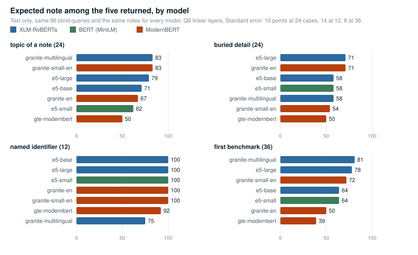
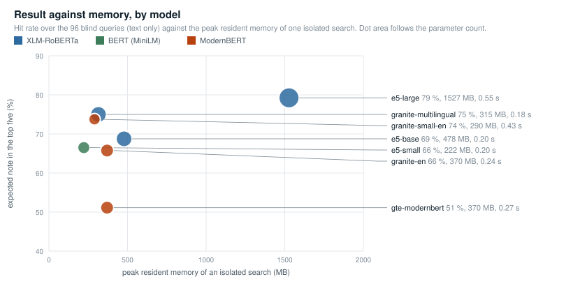
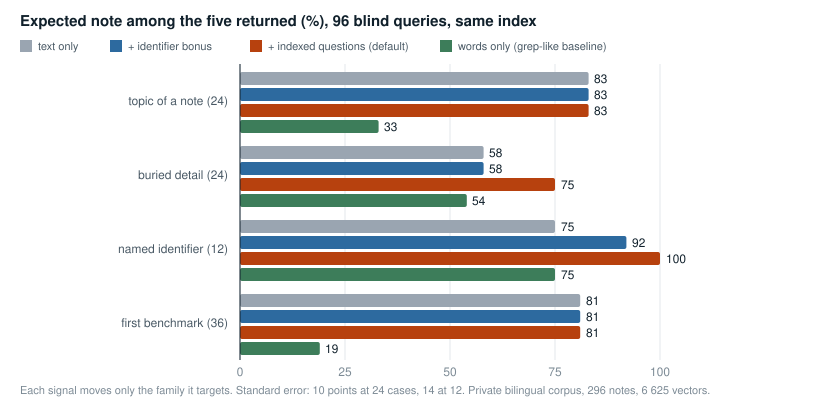
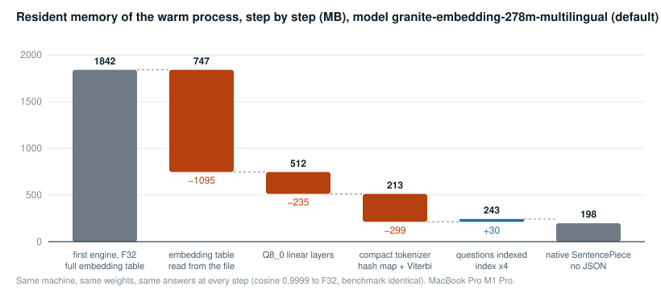

# Benchmarks

Every number below was measured on one machine (MacBook Pro M1 Pro, 32 GB) against
one corpus: 296 markdown notes in French and English, 21 projects, 1 661 paragraphs
with the default model, plus 4 964 generated questions, 6 625 vectors in total. The
corpus is private; the method and the tooling are in this repository so anyone can
reproduce the protocol on their own notes.

Every table and every chart names the model it was measured with. Unless stated
otherwise the linear layers are Q8_0 with F32 activations, the default precision.

## Protocol

Four query families, reported separately and never merged into one score:

| family | cases | what it targets |
|---|---|---|
| topic of a note | 24 | the subject of a note, query written blind from its first chunk |
| buried detail | 24 | a passage in the second half of a note, query written blind from that passage only |
| named identifier | 12 | a query naming an identifier (ticket key, field, class) present in one note |
| first benchmark | 36 | the queries of the first attempt, one third in the other language than the note |

Blind means the author of the query sees the target passage and nothing else, never
the title or the description. One third of the queries are written in the other
language than the passage. Targets are drawn with a fixed seed
(`examples/draw_targets.rs`).

The metric that counts is **the expected note among the five returned**, because
five notes is what `engram search` shows. A proportion on *n* cases has a standard
error of √(p(1−p)/n): 14 points at 12 cases, 10 at 24, 8 at 36. Two variants that
differ by two cases out of twenty-four are not distinguished, and the tables say so.
The "overall" figure of the model comparison is the hit rate over the 96 queries,
each family weighted by its number of cases.

## The models compared

Seven checkpoints, the ones `engram models` offers. Same notes, same 96 queries,
text only (no indexed questions, no identifier bonus) so that only the encoder
changes. The isolated call is measured on a two-note root: load the model, encode
one query, rank, exit, best of three runs, peak resident memory from `time -l`.

| model | alias | family | parameters | window | topic (24) | detail (24) | identifier (12) | first bench (36) | overall (96) | isolated call | peak memory |
|---|---|---|---|---|---|---|---|---|---|---|---|
| granite-embedding-278m-multilingual | `granite-multilingual` (default) | XLM-RoBERTa | 278 M | 512 | **83 %** | 58 % | 75 % | **81 %** | 75 % | **0.18 s** | 315 MB |
| multilingual-e5-small | `e5-small` | BERT (MiniLM) | 118 M | 512 | 62 % | 58 % | **100 %** | 64 % | 66 % | 0.20 s | **222 MB** |
| multilingual-e5-base | `e5-base` | XLM-RoBERTa | 278 M | 512 | 71 % | 58 % | **100 %** | 64 % | 69 % | 0.20 s | 478 MB |
| multilingual-e5-large | `e5-large` | XLM-RoBERTa large | 560 M | 512 | 79 % | **71 %** | **100 %** | 78 % | **79 %** | 0.55 s | 1 527 MB |
| granite-embedding-97m-multilingual-r2 | `granite-multilingual-r2` | ModernBERT | 97 M | 32 768 | **83 %** | 54 % | **100 %** | 72 % | 74 % | 0.43 s | 290 MB |
| granite-embedding-english-r2 | `granite-en` | ModernBERT | 149 M | 8192 | 67 % | **71 %** | **100 %** | 50 % | 66 % | 0.24 s | 370 MB |
| gte-modernbert-base | `gte-modernbert` | ModernBERT | 149 M | 8192 | 50 % | 50 % | 92 % | 39 % | 51 % | 0.27 s | 370 MB |

<p align="center"></p>

<p align="center"></p>

Reading, family by family:

- **Topic of a note.** The two granite models lead at 83 %, e5-large follows at 79 %,
  all within one standard error of each other. gte-modernbert is thirty points
  behind on a corpus where a third of the queries are in French.
- **Buried detail.** e5-large and granite-en reach 71 % on text alone. The default
  model gets there only with the indexed questions (see the next section), which
  cost nothing at search time.
- **Named identifier.** Every model except the default and gte-modernbert scores
  100 % on the twelve cases. The default model's 75 % is why the identifier bonus
  exists: with it the default reaches 92 %, with the questions 100 %.
- **First benchmark, one third cross-language.** The default model keeps its lead at
  81 %, e5-large is at 78 %, the 97 M multilingual ModernBERT is at 72 %, and the two
  English models fall to 50 % and 39 %, which is what English-only models should do
  on French queries.

Reading, cost against result: the default model is the best trade on this corpus,
75 % overall for 315 MB and 0.18 s. e5-large buys four points overall and thirteen
on buried details for five times the memory and three times the latency. e5-small
gives up nine points for a hundred fewer megabytes. granite-multilingual-r2 is the
lightest ModernBERT and a multilingual one: 74 % overall, 290 MB, a 32 768-token
window that keeps a whole note in one vector (1 117 chunks against 1 661). Its 0.43 s
isolated call is the byte-level BPE vocabulary parsed from JSON at every start, not
the model.

Discarded after measurement: bge-m3 (no safetensors weights in its repository),
static embeddings (20 to 30 points below the transformer on the first sixty
queries: 58 / 25 / 53 against 75 / 42 / 81 for the default model, text only), and
the library implementation of the ModernBERT graph (cosine 0.85 with the reference
because of a hard-coded activation; the graph shipped here reads it from the
configuration and reaches 1.000000).

## Context cost: what reaches the model

The reason to run a memory engine next to an agent is not only to find the note, it
is to spend fewer tokens finding it. `examples/tokens.rs` runs, for each of the 96
benchmark queries, the two ways an agent has to reach the note that answers, and
measures what enters its context. Sizes are characters, tokens are estimated at four
characters per token. Default model, every signal on.

| path to the answer | tool output | notes read | total per query | tokens (est.) | expected note reached |
|---|---|---|---|---|---|
| grep, one list of files per word, then the notes in grep order (5 at most) | 48 266 | 86 082 | 134 348 | 33 587 | 35 / 96 |
| `engram search`, then `engram read` of the note it returned | 2 024 | 7 367 | 9 391 | 2 348 | 78 / 96 |
| `engram answer`, the passages only, what the hook and the MCP tool give | 2 070 | 0 | 2 070 | 518 | 70 / 96 |

Reading: the grep path costs fourteen times more context per question and reaches
the right note half as often, because it reads whole notes in an order that words
alone decide. The passages of `engram answer` cite the expected note in 70 cases out
of 96 for about five hundred tokens, and the search-then-read path, which brings the
whole note in, stays under 2 400.

### What it costs at list prices

The difference is input tokens, and input tokens have a price. The table applies the
list prices of the three main providers as published on 2026-09-06 to the three
paths above, per thousand questions. Prices per million input tokens, standard
tier, no prompt caching and no batch discount: the notes an agent reads to answer a
question are new content each time, which a cache does not cover, and the questions
of a working session are not a batch.

| model | input price / MTok | grep path (33 587 tokens) | search and read (2 348) | passages only (518) | saved, search and read | saved, passages only |
|---|---|---|---|---|---|---|
| Claude Fable 5.1 | $10 | $335.9 | $23.5 | $5.2 | $312.4 | $330.7 |
| GPT-6 Astra | $10 | $335.9 | $23.5 | $5.2 | $312.4 | $330.7 |
| Claude Opus 5 | $5 | $167.9 | $11.7 | $2.6 | $156.2 | $165.3 |
| GPT-5.5 | $5 | $167.9 | $11.7 | $2.6 | $156.2 | $165.3 |
| GPT-5.6 Sol | $4 | $134.3 | $9.4 | $2.1 | $124.9 | $132.2 |
| Claude Sonnet 5 | $2 | $67.2 | $4.7 | $1.0 | $62.5 | $66.2 |
| GPT-5.6 Terra | $2 | $67.2 | $4.7 | $1.0 | $62.5 | $66.2 |
| Gemini 3.1 Pro Preview | $2 (prompts up to 200k) | $67.2 | $4.7 | $1.0 | $62.5 | $66.2 |
| Gemini 3.8 Flash | $0.75 (until 2026-12-31) | $25.2 | $1.8 | $0.4 | $23.4 | $24.8 |

Sources: [Anthropic](https://platform.claude.com/docs/en/about-claude/pricing),
[OpenAI](https://developers.openai.com/api/docs/pricing),
[Google](https://ai.google.dev/gemini-api/docs/pricing). Two remarks that push the
figures up rather than down. Tokens are estimated at four characters, the rule the
providers give for English; Anthropic states that its tokenizer from Claude 4.7 on
yields about 30 % more tokens for the same text, so the billed savings on those
models are larger than the table. And output tokens are unchanged by the tool, the
saving is entirely on input, which is also the part that fills the context window
and degrades the answers when it grows.

At the author's measured cadence, 161 searches a day through the hook and the
agents, the grep path would cost 5.4 million input tokens a day and Engrams 0.38
million (or 0.08 with the passages alone): on Claude Opus 5, $27 a day against
$1.9, on Claude Sonnet 5 or Gemini 3.1 Pro $11 against $0.8. The engine itself
costs nothing per query: it runs on the CPU of the machine, 198 MB resident.

The hot index a session loads at start is bounded too: 17 408 bytes per project, so
at most about 4 400 tokens, where the notes of a project would be far more. On this
corpus, 20 projects:

| what a session could load | chars | tokens (est.) |
|---|---|---|
| the hot indexes as generated, bounded, all projects together | 50 145 | 12 537 |
| one line per active note, no bound | 55 551 | 13 888 |
| every note of the corpus | 1 700 757 | 425 190 |

A session loads one project's index, 2 500 characters on average here and 17 408 at
most, against 1.7 MB if it loaded the notes. The bound rarely bites on this corpus
(one line per note would be 11 % larger), it is there for the projects that grow.

## The default model in detail

Everything in this section is measured with `granite-embedding-278m-multilingual`,
Q8_0 linear layers, the configuration `engram init` installs when no other model is
chosen.

### Retrieval signals

Same index for every column; ablations remove signals before ranking
(`ENGRAM_NO_QUESTIONS=1`, `ENGRAM_ID_BONUS=0`, `ENGRAM_LEXICAL=1`).

| family | words only | text only | + identifier bonus | + indexed questions (default) |
|---|---|---|---|---|
| topic of a note (24) | 33 % | 83 % | 83 % | 83 % |
| buried detail (24) | 54 % | 58 % | 58 % | **75 %** |
| named identifier (12) | 75 % | 75 % | **92 %** | **100 %** |
| first benchmark (36) | 19 % | 81 % | 81 % | 81 % |

<p align="center"></p>

Reading: each signal moves only the family it was designed for. The identifier bonus
adds seventeen points on identifiers and nothing elsewhere. Indexed questions add
seventeen points on buried details, lift the right passage from 46 % to 62 % on that
family, and leave the topic families unchanged. The words-only baseline is a
well-ranked grep: it nearly suffices on identifiers, which is why the engine keeps a
lexical signal, and it does not cross the language boundary.

Discarded after measurement, all within noise: vector centering (83 / 42 / 78 on the
first sixty queries), maximal marginal relevance reranking (50 / 58 / 81).

### Memory

Resident memory of the warm process, one intervention at a time, concordance with
the reference and benchmark identical at each step:

| step | resident | change |
|---|---|---|
| first engine, F32 weights, one tokenizer | 1 842 MB | |
| embedding table read from the mapped file instead of loaded | 747 MB | −1 095 |
| Q8_0 on the linear layers, F32 activations | 512 MB | −235 |
| compact tokenizer (hash map and Viterbi) | 213 MB | −299 |
| 4 964 questions indexed, index ×4 | 243 MB | +30 |
| native SentencePiece model, no JSON parse | **198 MB** | −45 |

<p align="center"></p>

An isolated call on the full corpus (load, answer, exit) peaks at 310 MB and takes
0.21 s; on the two-note root of the model comparison, 315 MB and 0.18 s.

### Latency and throughput

| indicator | isolated call | warm process |
|---|---|---|
| latency per search | 0.21 s | 0.10 s (0.09 to 0.12 over ten runs) |
| CPU per search | 0.42 s | ≈ 0.40 s, client included |
| resident between calls | 0 | 198 MB |
| serial throughput | ≈ 4 req/s | 9.3 req/s |
| first call after an index write | 2.06 s | 0.24 s |

Model load 117 ms (28 ms for the vocabulary), query encoding 47 ms, index of 20.9 MB
read in about 15 ms, full re-embedding of 1 661 paragraphs 313 s on eight threads
(841 s on one). Ranking 6 625 vectors of 768 dimensions: 4 ms.

### Fidelity of Q8 to F32

One paragraph in six of the corpus (278), embedded in F32 then in Q8_0:

| tokens | n | min cosine | median |
|---|---|---|---|
| under 64 | 7 | 0.99990 | 0.99993 |
| 64 to 127 | 27 | 0.99988 | 0.99992 |
| 128 to 255 | 75 | 0.99988 | 0.99992 |
| 256 to 512 | 169 | 0.99988 | 0.99992 |

The gap does not grow with length: quantisation errors are zero-mean and cancel in
the dot product. Dynamic int8 (quantised activations) had cost eight to eleven points
of recall on the same benchmark; Q8_0 on weights only is a different object.

### Tokenizer

| implementation | load | resident | parity |
|---|---|---|---|
| reference crate (`tokenizers`) | 237 ms | 380 MB | reference |
| compact Unigram, from `tokenizer.json` | 52 ms | 79 MB peak, 30 MB resident | 0 mismatch on 2 027 texts |
| compact Unigram, native `sentencepiece.bpe.model` | 28 ms | 43 MB peak, 30 MB resident | 0 mismatch on the same texts |

The parity test runs on every installed tokenizer: the XLM-R layout
(`WhitespaceSplit` then `Metaspace`), the `Metaspace`-only layout of
multilingual-e5-small, and the byte-level BPE of the ModernBERT models, each against
the reference crate on the corpus plus edge cases.

## The ModernBERT models in detail

`granite-embedding-97m-multilingual-r2`, `granite-embedding-english-r2` and
`gte-modernbert-base` share the ModernBERT graph: alternating global and
sliding-window attention, rotary positions, gated MLP, activation read from the
configuration, byte-level BPE tokenizer. Their long window (32 768 tokens for the
97 M multilingual one, 8 192 for the two English ones) merges paragraphs into
1 117 to 1 121 chunks instead of 1 661, so the "right passage" column of the benchmark
is not comparable with the 512-token models.

Concordance with the reference vectors on granite-embedding-97m-multilingual-r2: cosine
1.000000 in F32, 0.99986 in Q8. The library implementation of the graph stalled at
0.85 on this model because it hard-codes a GELU activation where the configuration
says SiLU.

Of the three, the 97 M multilingual one is the better choice on this corpus: it holds
the topic family at 83 % and the identifiers at 100 %, and the two English base
models do not pay back their extra 80 MB (granite-en loses sixteen points on topics
and twenty-two on the cross-language family, gte-modernbert loses more). The long window has a cost at
indexing time: gte-modernbert-base took 1 307 s and granite-embedding-english-r2
1 673 s to embed the corpus on a machine that was also compiling, where
multilingual-e5-small took 237 s on a quiet one, because a whole paragraph goes
through the global attention layers in one piece.

## What was tried and removed

- **Metal, F16.** Five times faster encoding once warm, but 9.4 s of kernel
  compilation per process and thirteen all-NaN vectors on real paragraphs of 100 to
  350 tokens (layer-norm sum of squares overflows F16). Removed; the encoder now
  refuses any non-finite vector.
- **BF16 on CPU.** No matmul in the inference library.
- **Static embeddings.** 20 to 30 points of recall below the transformer.
- **The library ModernBERT graph.** Cosine 0.85 with the reference; replaced by a
  graph written after the reference implementation, at 1.000000.
- **bge-m3.** No safetensors weights upstream; multilingual-e5-large covers the same
  slot.

## Reproduce

```sh
engram index                                   # build the index on your notes
cargo run --release --example draw_targets 24  # JSON skeleton of blind targets, fill the queries
cargo run --release --example bench            # the tables above, on your corpus
ENGRAM_NO_QUESTIONS=1 cargo run --release --example bench
ENGRAM_LEXICAL=1 cargo run --release --example bench
ENGRAM_MODEL=~/.engram/models/multilingual-e5-base cargo run --release --example bench   # another model, after `engram index` with it
cargo run --release --example q8_fidelity 6    # Q8 versus F32 on one paragraph in six
cargo run --release --example load_probe       # load and encode times
cargo run --release --example rss_probe        # resident memory step by step
cargo run --release --example charts           # redraw models-quality.svg and models-efficiency.svg from the numbers typed in
cargo run --release --example tokens           # context spent per question, grep against the engine, and the hot index sizes
```

To measure an isolated call: a root with two notes, `engram index` with the model,
then `/usr/bin/time -l engram search "…"` three times with `ENGRAM_NO_DAEMON=1`.
